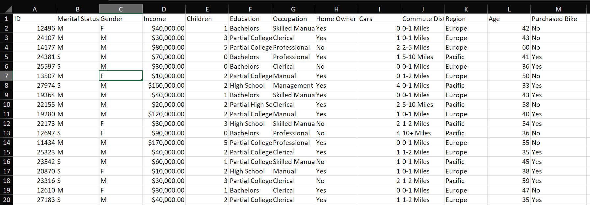
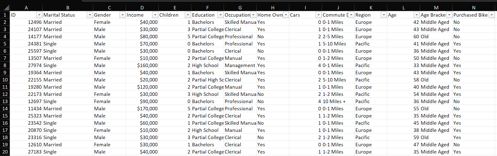
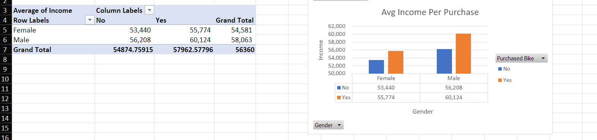
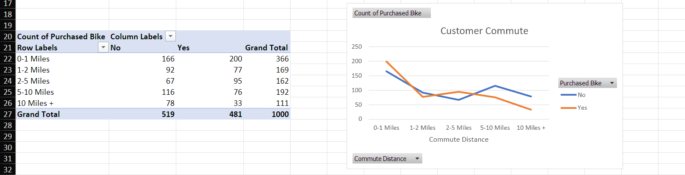
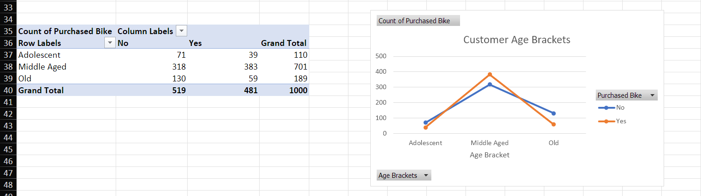
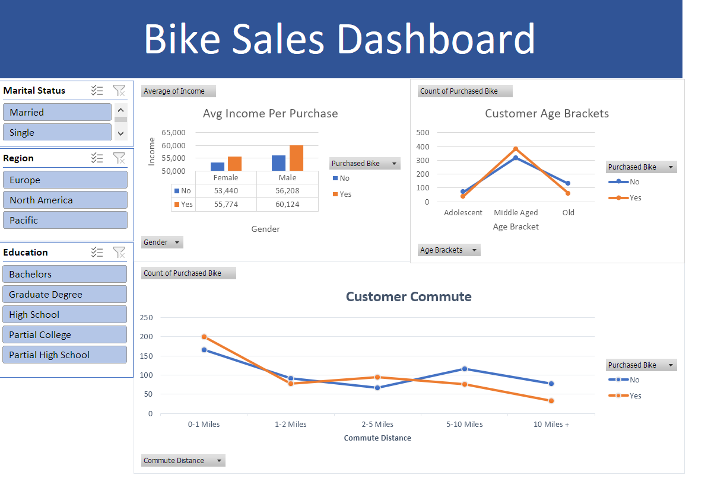
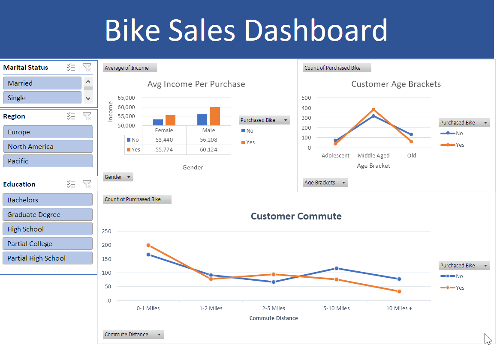

# Bike Sales Dashboard in Excel

#Table of Contents
-{Objective](#objective)
-[Goal](#goal)
-[Plan](#plan)
-[Data Source](#data-source)
-[Data Cleaning](#data-cleaning)
-[Visualizations](#pivot-tables-and-charts)
-[Dashboard](#dashboard)
-[Key Insights](#key-insights)
-[Findings](#findings)
-[Business Recommendations](business-recommendations)

# Objective
A cycling company wants to which customer demographics are most likely to purchase bikes. They want a simple visual that lets them easily interpret their data. 

-Goal
To create visualizations for the demographics of people who purchase bikes.

-Plan
Create tables and pivot tables using Excel. 
The following fields will be used for the pivot tables:

1. Average Income Per Purchase
2. Customer Commute
3. Age Bracket

# Data Source
The data is sourced from Kaggle. It is a collection of a 1000 various [Bike Buyers}(https://www.kaggle.com/datasets/heeraldedhia/bike-buyers).

# Tools used

-Microsoft Excel

# Data Exploration
 There are 13 columns in total listing the average information for a customer. Each customer has a unique ID. No null values were found.

 

# Data Cleaning

The data is already in a pretty useable state. We will only make a few slight formatting adjustments.

1. Removed duplicates
2. Expand the abbreviations of Marital Status and Gender into their full words for readability.
3. Removed empty decimal places.
4. There are various ages listed across the dataset. So we will add a new column that groups them into age brackets:
   -Adolescent
   -Middle Age
   -Old

# Pivot Tables and Charts

Now that our data is ready we will create pivot table and graphs to use them.

## Average Income

Pivot Table covering the customer's average income and whether or not they purchased a bicycle. Graph is a bar chart separated by male and female.

## Commute Distance

The distance customers travel during their daily commutes. Visualized using a line chart.

## Age Range

The purchasing decisions separated by age brackets. Used a line chart.

# Dashboard

Now that we have all of our charts, we will build the dashboard.

1. Created a header to title the dashboard.
2. Ogranized our 3 charts.
3. Added slicers for marital status, region, and education level so that the data can be filtered.

# Key Insights

- Customers with higher incomes are more liekly to purchase bikes.
- Married customers buy more bikes than single ones. Likely buying them in pairs.
- MIddle-aged customers but the most bikes.
- Custoemrs with longer commute tend to buy fewer ones, opting for other transportation methods.
- Customers with higher education levels purchase more bikes.

# Findings

 There are some key takeaways we can immediately get from this information. Those with larger incomes are more likely to purchase bikes. Married couples buy more bikes than single customers. Likely bought as a pair to ride together. When it comes to age, the largest amount of bikes are bought by those in their middle age. Those with with longer commutes don't buy as many bikes and opt for other modes transportation. And lastly, people with higher levels of education bought more bikes. 

# Business Recommendations

-Target marketing towards middle-aged consumers.
-Promote bundles to married couples.
-Create campaigns aimed towards high income and high education customers.
